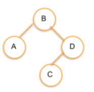

Binary Node Add
---

## Challenge

Implement the add method for this `BinaryTreeNode` class:

```js
class BinaryTreeNode {
  constructor(value) {
    this.value = value;
    this.left = null;
    this.right = null;
  }

  add(node) {
    // Implement me!
  }
}
```

Keep in mind this is a recursive operation.

## Test Cases

```js
const B = new BinaryTreeNode('B');
const A = new BinaryTreeNode('A');
const C = new BinaryTreeNode('C');
const D = new BinaryTreeNode('D');

// B will be the root of the tree:
B.add(A);
B.add(D);
B.add(C);
```



## Note

FYI: the shape of a Binary Tree is dependant on order of construction.

